# 📄 AI Document Processor

A simple, efficient document processing pipeline that analyzes PDFs using AI to extract content, classify document types, detect languages, and generate summaries.

## 🚀 Features

- ✅ **Page Limit Validation** - Processes only documents with ≤5 pages
- 🔍 **Multimodal Content Extraction** - Handles text, images, tables, and diagrams
- 🤖 **AI-Powered Analysis** - Language detection, document classification, and summarization
- 📊 **Structured JSON Output** - Clean, standardized results
- 🏠 **Local LLM Integration** - Works with LM Studio for privacy

## 🏗️ Architecture Flow

```mermaid
flowchart TD
    A[📁 Start] --> B[📤 File Upload]
    B --> C{📄 PDF & Word Docs}
    C --> D[🔍 Page Limit Check<br/>Max 5 Pages]
    D --> E{✅ Valid?}
    E -->|No| F[❌ Reject Document]
    E -->|Yes| G[🔧 LlamaParse Extraction<br/>Images, Tables, Diagrams]
    G --> H[🤖 Local LM Studio Analysis]
    H --> I[🎯 Language Detection]
    H --> J[📝 Document Classification]  
    H --> K[📋 Summary Generation]
    I --> L[📊 JSON Output]
    J --> L
    K --> L
    F --> M[⚠️ Error Response]
    L --> N[✅ Success Response]
    
    style A fill:#e1f5fe
    style L fill:#c8e6c9
    style F fill:#ffcdd2
    style G fill:#fff3e0
    style H fill:#f3e5f5
```



## 📋 Document Types Supported

| Type | Description | Keywords |
|------|-------------|----------|
| 📄 Resume | CV, Professional profiles | experience, skills, education, employment |
| 💌 Letter | Formal/informal correspondence | dear, sincerely, regards, yours truly |
| 🧾 Invoice | Bills, payment documents | invoice, payment, total, amount due |
| 📝 Blog | Articles, posts, content | article, blog, author, published |
| 📋 Other | Any other document type | fallback category |

## 🛠️ Installation

### Prerequisites
- Python 3.8+
- LM Studio running locally
- LlamaParse API key

### Setup

1. **Clone the repository**
   ```bash
   git clone https://github.com/KarthikChekuri/AI_Document_Processor.git
   cd AI_Document_Processor
   ```

2. **Install dependencies**
   ```bash
   pip install pypdf llama-parse requests python-dotenv
   ```

3. **Configure environment**
   Create a `.env` file:
   ```env
   API_KEY=your_llamaparse_api_key_here
   ```

4. **Start LM Studio**
   - Open LM Studio
   - Load your preferred model
   - Start server on localhost:1234

## 🚀 Usage

### Basic Usage
```python
from document_processor import process_document

# Process a document
result = process_document("your_document.pdf")
print(result)
```

### Command Line
```bash
python document_processor.py
```

## 📊 Output Format

### Success Response
```json
{
  "language": "English",
  "document_type": "resume",
  "summary": "John Doe is a software engineer with 5 years of experience in Python and machine learning..."
}
```

### Error Responses
```json
{
  "error": "Document too long (more than 5 pages)"
}
```

## 🔧 Configuration

### LM Studio Settings
- **Port**: 1234 (default)
- **Temperature**: 0.1 (for consistent results)
- **Max Tokens**: 500

### Document Limits
- **Maximum Pages**: 5
- **Supported Formats**: PDF, DOCX
- **Content Types**: Text, Images, Tables, Diagrams

## 📈 Processing Pipeline

```mermaid
sequenceDiagram
    participant U as User
    participant DP as Document Processor
    participant PP as PyPDF Reader
    participant LP as LlamaParse
    participant LM as LM Studio
    
    U->>DP: Upload Document
    DP->>PP: Check Page Count
    PP-->>DP: Page Count
    
    alt Pages > 5
        DP-->>U: Error: Too Many Pages
    else Pages ≤ 5
        DP->>LP: Extract Content
        LP-->>DP: Multimodal Content
        DP->>LM: Analyze Content
        LM-->>DP: Classification Results
        DP-->>U: JSON Response
    end
```



## 🎯 Examples

### Resume Processing
```json
{
  "language": "English",
  "document_type": "resume",
  "summary": "Software engineer with expertise in AI/ML and 3 years of experience at tech companies."
}
```

### Invoice Processing
```json
{
  "language": "English", 
  "document_type": "invoice",
  "summary": "Invoice #12345 for web development services totaling $2,500 due by March 15th."
}
```

## 🔍 Troubleshooting

### Common Issues

| Issue | Solution |
|-------|----------|
| Connection refused | Ensure LM Studio is running on port 1234 |
| Invalid API key | Check your LlamaParse API key in .env |
| Document too long | Use documents with ≤5 pages |
| JSON parsing error | Verify LLM is returning valid JSON |


## Reference

- [LlamaParse](https://docs.llamaindex.ai/en/stable/llama_cloud/llama_parse/) for multimodal document parsing
- [LM Studio](https://lmstudio.ai/) for local LLM inference
- [PyPDF](https://pypdf.readthedocs.io/) for PDF processing

