# 📄 AI Document Processor

A comprehensive document processing pipeline that analyzes PDFs and Word documents using AI to extract content, classify document types, detect languages, and generate summaries using GitHub Models or OpenAI API.

## 🚀 Features

- ✅ **File Validation** - Checks file existence and format support
- 📏 **Size & Page Limits** - Configurable limits (default: 10MB, 10 pages)
- 🔍 **Multimodal Content Extraction** - Handles text, images, tables, and diagrams via LlamaParse
- 🤖 **AI-Powered Analysis** - Language detection, document classification, and summarization
- 📊 **Structured JSON Output** - Clean, standardized results with token usage tracking
- 🌐 **Flexible AI Backends** - Works with GitHub Models (default) or OpenAI API
- 🏗️ **Modular Architecture** - Clean separation of concerns with dependency injection

## 🏗️ Architecture Flow

```mermaid
flowchart TD
    A[📁 Start] --> B[📤 File Upload]
    B --> C{📄 PDF & Word Docs}
    C --> D[🔍 File Validation<br/>Existence Check]
    D --> E[📏 Size Check<br/>Max 10MB]
    E --> F[📄 Page Limit Check<br/>Max 10 Pages]
    F --> G{✅ Valid?}
    G -->|No| H[❌ Reject Document]
    G -->|Yes| I[🔧 LlamaParse Extraction<br/>Images, Tables, Diagrams]
    I --> J[📖 Content Reading]
    J --> K[🤖 GitHub Models/OpenAI Analysis]
    K --> L[🎯 Language Detection]
    K --> M[📝 Document Classification]  
    K --> N[📋 Summary Generation]
    L --> O[📊 Structured JSON Output]
    M --> O
    N --> O
    H --> P[⚠️ Error Response]
    O --> Q[✅ Success Response]
    
    style A fill:#e1f5fe
    style O fill:#c8e6c9
    style H fill:#ffcdd2
    style I fill:#fff3e0
    style K fill:#f3e5f5
```



## 📋 Document Types Supported

| Type | Description | Keywords |
|------|-------------|----------|
| 📄 **resume** | CV, Professional profiles | experience, skills, education, employment |
| 💌 **letter** | Formal/informal correspondence | dear, sincerely, regards, business letters |
| 🧾 **invoice** | Bills, payment documents | invoice, payment, total, amount due, receipts |
| 📝 **blog** | Articles, posts, content | blog posts, articles, informal writing |
| 📋 **other** | Any other document type | reports, manuals, contracts, technical docs |

## 🛠️ Installation

### Prerequisites
- Python 3.8+
- LlamaParse API key (from LlamaIndex Cloud)
- GitHub Token (for GitHub Models) OR OpenAI API Key

### Setup

1. **Clone the repository**
   ```bash
   git clone https://github.com/KarthikChekuri/AI_Document_Processor.git
   cd AI_Document_Processor
   ```

2. **Install dependencies**
   ```bash
   pip install pypdf llama-cloud-services python-dotenv openai
   ```

3. **Configure environment**
   Create a `.env` file:
   ```env
   # Required: LlamaParse API Key
   LLAMA_CLOUD_API_KEY=your_llamaparse_api_key_here
   
   # Choose one of the following:
   # Option 1: GitHub Models (Recommended)
   GITHUB_TOKEN=your_github_token_here
   
   # Option 2: OpenAI API
   OPENAI_API_KEY=your_openai_api_key_here
   ```

## 🚀 Usage

### Basic Usage
```python
from document_processor import DocumentProcessor

# Initialize processor with custom settings
processor = DocumentProcessor(
    max_pages=10,        # Maximum pages allowed
    max_size_mb=10,      # Maximum file size in MB
    ai_model="gpt-4o-mini"  # AI model to use
)

# Process a document
result = processor.process("path/to/your/document.pdf")
print(result)
```

### Command Line
```bash
# Edit the FILE_PATH in main() function, then run:
python document_processor.py
```

### Advanced Configuration
```python
# Custom processor with different limits
processor = DocumentProcessor(
    max_pages=5,           # Stricter page limit
    max_size_mb=5,         # Smaller file size limit
    ai_model="gpt-4o"      # More powerful model
)

# Process multiple documents
documents = ["doc1.pdf", "doc2.docx", "doc3.pdf"]
results = []
for doc in documents:
    result = processor.process(doc)
    results.append(result)
```

## 📊 Output Format

### Success Response
```json
{
  "success": true,
  "file_path": "path/to/document.pdf",
  "file_size_mb": 2.34,
  "content_length": 1250,
  "tokens_used": 342,
  "analysis": {
    "doc_type": "resume",
    "lang_type": "en",
    "summary": "John Doe is a software engineer with 5 years of experience in Python and machine learning, currently seeking senior developer positions."
  }
}
```

### Error Responses
```json
{
  "error": "Document too long (more than 10 pages)"
}
```

```json
{
  "error": "File too large: 12.45MB (max: 10MB)"
}
```

```json
{
  "error": "LLAMA_CLOUD_API_KEY not found in environment variables"
}
```

## 🔧 Configuration Options

### Document Limits
| Setting | Default | Description |
|---------|---------|-------------|
| `max_pages` | 10 | Maximum pages for PDF documents |
| `max_size_mb` | 10 | Maximum file size in megabytes |
| `ai_model` | gpt-4o-mini | AI model for analysis |

### Supported AI Models
- **GitHub Models**: `gpt-4o`, `gpt-4o-mini`
- **OpenAI**: `gpt-4o`, `gpt-4o-mini`, `gpt-4-turbo`

### File Formats
- **PDF**: All versions supported
- **Word**: `.docx` format supported
- **Content Types**: Text, Images, Tables, Diagrams

## 📈 Processing Pipeline


## 🎯 Examples

### Resume Processing
```json
{
  "success": true,
  "file_path": "resume.pdf",
  "file_size_mb": 1.2,
  "content_length": 2150,
  "tokens_used": 280,
  "analysis": {
    "doc_type": "resume",
    "lang_type": "en",
    "summary": "Software engineer with expertise in AI/ML and 3 years of experience at tech companies."
  }
}
```

### Invoice Processing
```json
{
  "success": true,
  "file_path": "invoice.pdf",
  "file_size_mb": 0.8,
  "content_length": 850,
  "tokens_used": 120,
  "analysis": {
    "doc_type": "invoice",
    "lang_type": "en",
    "summary": "Invoice #12345 for web development services totaling $2,500 due by March 15th."
  }
}
```

### Letter Processing
```json
{
  "success": true,
  "file_path": "cover_letter.docx",
  "file_size_mb": 0.5,
  "content_length": 1200,
  "tokens_used": 180,
  "analysis": {
    "doc_type": "letter",
    "lang_type": "en",
    "summary": "Cover letter for software engineer position highlighting relevant experience and enthusiasm."
  }
}
```

## 🔍 Troubleshooting

### Common Issues

| Issue | Solution |
|-------|----------|
| **Missing API Key** | Ensure `LLAMA_CLOUD_API_KEY` is set in `.env` |
| **File Not Found** | Verify file path is correct and file exists |
| **Document Too Large** | Use files smaller than 10MB or adjust `max_size_mb` |
| **Too Many Pages** | Use documents with ≤10 pages or adjust `max_pages` |
| **AI Analysis Failed** | Check GitHub token or OpenAI API key validity |
| **Parsing Error** | Ensure document is not corrupted or password-protected |

### Debug Mode
```python
# Enable verbose logging for LlamaParse
import logging
logging.basicConfig(level=logging.DEBUG)

# Process with detailed output
result = processor.process("document.pdf")
```

## 🏗️ Architecture Components

### Core Classes
- **`DocumentProcessor`**: Main orchestrator class
- **`FileChecker`**: Validates file existence
- **`PDFSizeChecker`**: Validates file size limits
- **`PDFPageChecker`**: Validates page count limits
- **`LlamaParseService`**: Handles document parsing
- **`DocumentReader`**: Processes extracted content
- **`GitHubAI`**: AI analysis with structured output

### Design Patterns
- **Dependency Injection**: Components are injected into the main processor
- **Single Responsibility**: Each class has one clear purpose
- **Structured Output**: Uses OpenAI's JSON schema for consistent results
- **Error Handling**: Comprehensive error checking at each step

## 📝 API Reference

### DocumentProcessor Class
```python
class DocumentProcessor:
    def __init__(self, max_pages: int = 10, max_size_mb: int = 10, ai_model: str = "gpt-4o-mini")
    def process(self, file_path: str) -> Dict[str, Any]
```

### GitHubAI Class
```python
class GitHubAI:
    def __init__(self, api_key: Optional[str] = None, 
                 base_url: str = "https://models.inference.ai.azure.com",
                 model: str = "gpt-4o-mini")
    def analyze_document(self, text: str) -> Dict[str, Any]
```

## 🌟 Recent Updates

- ✅ Added file size validation
- ✅ Implemented GitHub Models integration
- ✅ Added structured JSON output with schema validation
- ✅ Enhanced error handling and validation
- ✅ Added token usage tracking
- ✅ Improved modular architecture with dependency injection
- ✅ Added comprehensive file format support

## 🔗 References

- [LlamaParse](https://docs.llamaindex.ai/en/stable/llama_cloud/llama_parse/) for multimodal document parsing
- [GitHub Models](https://github.com/marketplace/models) for AI analysis
- [OpenAI API](https://platform.openai.com/docs/api-reference) for alternative AI backend
- [PyPDF](https://pypdf.readthedocs.io/) for PDF processing

## 📄 License

MIT License - See LICENSE file for details
